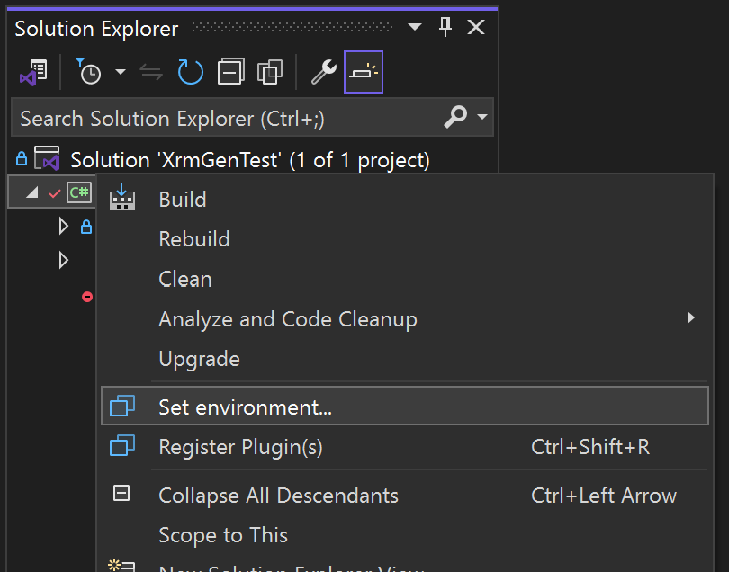
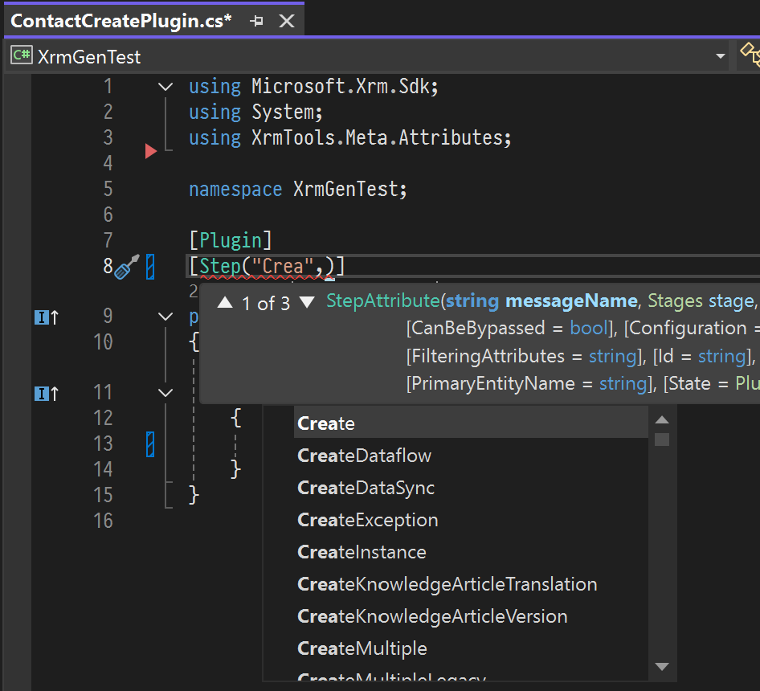
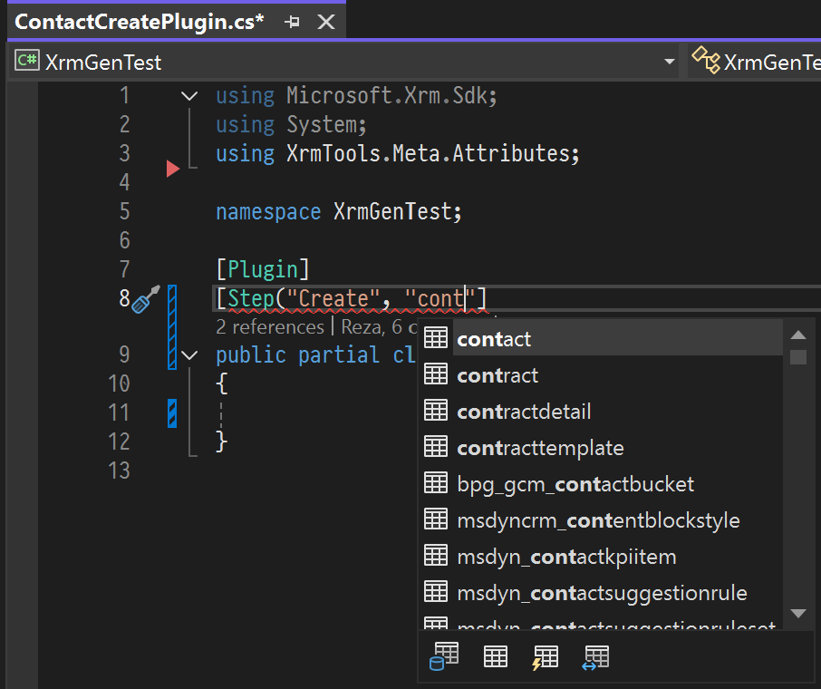
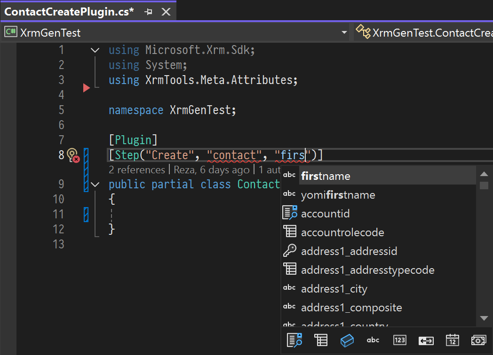
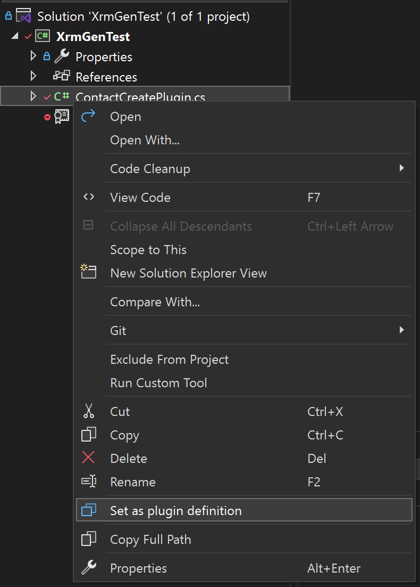
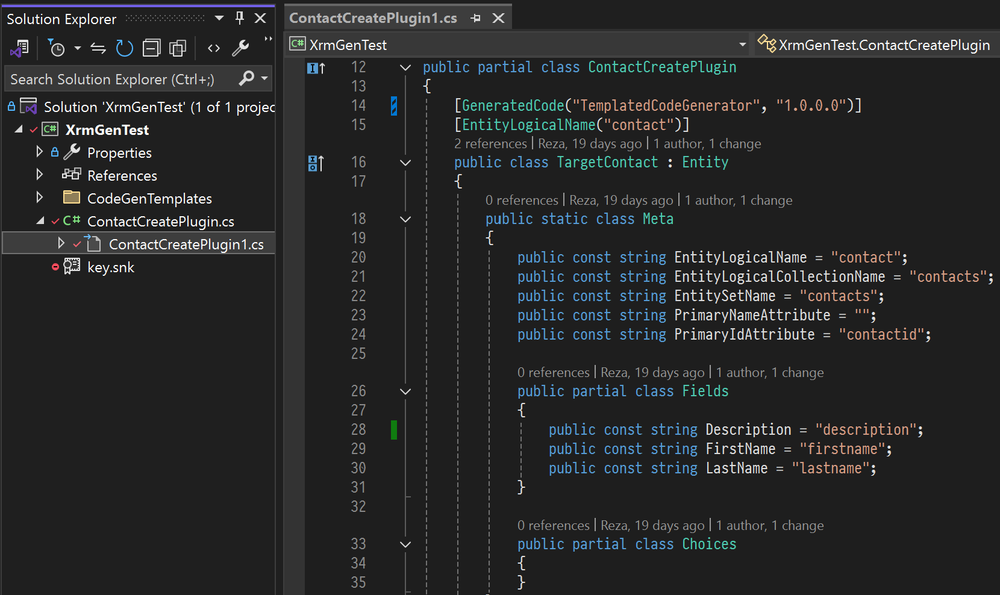

# What is Xrm Tools
Xrm Tools is a Visual Studio extension that aims to make Power Platform development feel native within Visual Studio. You will get Intellisense support for your Plugins, generate boiler plate code, typed entities and more right from within Visual Studio. You also have full control over the code generation using [Scriban](https://github.com/scriban/scriban) templates.

## Features

* Define plugins entirely in code using attributes.
* Intellisense for entities, attributes and more based on connected environment.
* Attribute colorization within strings.
* Traditional and packaged plugins.
* Solution awareness.
* Multi-environment.
* Secure secret managment using Windows Credential Management or environment variables.
* Binding environment to solution, project or global level per developer or per team.
* Customizable seamless code generation for plugins, custom APIs and entities.
* One-click plugin registration.
* One-click project registration.
* Fully customizable code generation using liquid-like templates.
* Support CSharp v12.0 via PolySharp.
* FetchXML editor and automatic code generation at save.

## Xrm Tools is a good citizin in Visual Studio
* XrmTools does not need admin privileges and will not apply any system-wide change in your machine nor the configuration of your Visual Studio or projects. 
* You can always remove the extension safely and completely when you don't need it.
* XrmTools does not send any information from your machine unlike some other extensions.
* XrmTools does not do any code generation at build time. In other words everything is done in development time where you see the changes transparently and benefit from Git for diffing and reviewing the code.
* XrmTools does not make you change your coding style. In other words, you don't have to inherit from a specific class or apply a special interface or things like that.
* All you need to apply are a number of attributes to define your intent so the extensions knows where and how to help.
* Should you decide to uninstall Xrm Tools, whatever you have developed with it will continue to work as there is no unsupported trickery going on behind the scenes.

# Connecting to a development environment
After you install Xrm Tools, the first thing you need to do is to connect to an environment so that Xrm Tools can see where you are developing to help you along the way. You can add as many environments as you want to later use any of them in your projects. When adding a new environment you can use your own account or use a secret or certificate safely without pushing any secrets to your repository. Let's now connect to an environment.
1. In Visual Studio, open the "Tools" menu and select "Options"
2. All the way to the bottom you will find "Xrm Tools".
3. Click on the three dots in front of "Environments".


5. Here you can add a new Power Platform environment to Visual Studio. You can give your environment a name and a connection string. The connection string syntax is very similar to the Xrm Tooling of Microsoft, only simpler and with extra security features built-in. For example the following syntax will use your current account to connect to an environment.
   ```shell
   Url=<environment URL>;Integrated Security=True;TenantId=<your tenant id>
   ```
   You can also simply enter the URL of your environment.
   ```shell
   <environment URL>
   ```
   If you only give a URL, Xrm Tools will try to find your tenant ID by making a request and will try to use your currently authenticated user that is running Visual Studio if you have SSO with your tenant, otherwise it will display the standard Entra popup and asks you to login. 
   
> [!NOTE]
>
> Xrm Tools will never see or store your credentials.
> You can read more about the connection string syntax [here](https://github.com/rezanid/xrmtools/wiki/Providing-Connection-Strings).

7. Set "Current Environment" to the environment that you just created.
8. Click "Ok" button to save the settings.

# How to write a Plugin
Xrm Tools enables you to define and write a plugin directly within code. There is no going back and forth between Makers portal, Plugin Registration Tool or XRM Toolbox or the terminal. Lets write a simple plugin together so you learn the ropes.

1. Create a new Type Library project in Visual Studio and choose .Net Framework 4.6.2 as your target framework.

2. From the "Tools" menu, select "Options", all the way down to the bottom, find "Xrm Tools".

3. Make sure "Current environment kept in" is set to "Project".

4. Right-click on your project on Solution Explorer and choose "Set environment...". Select an environment from the ones you added in [Connecting-to-a-development-environment](#connecting-to-a-development-environment).

   

5. Select your desired environment from the list that will be displayed. You can also test the connection to the environment before cofirming your choice.

6. Right-click on the project and select "Manage NuGet Packages...".

7. Install the latest "XrmTools.Meta.Attributes" package. This package will only add a few attributes to your project by including their source code.

8. Right-click on the project or anywhere under it and select Add > New > Class (or simply <kbd>Shift</kbd> + <kbd>Alt</kbd> + <kbd>C</kbd>). Name your class something that includes "Plugin" in the name.

9. Make your class `partial` and add `Plugin` attribute to your class. This attribute informs Xrm Tools that this is a plugin.
```csharp
[Plugin]
public partial class ContactCreatePlugin
{
}
```

10. Next, we will add the `[Step]` attribute and that is where the magic starts happening! Try to add a Step attribute similar to the one below.
```csharp
[Plugin]
[Step("Create", "contact", "firstname,lastname,description", Stages.PreOperation, ExecutionMode.Synchronous)]
public partial class ContactCreatePlugin
{
}
```
   Noticed how the Intellisense helps you pick the right message or when you set the message, only the entities that support the message are displayed?

<div style="overflow-x: auto; white-space: nowrap;">
  
  
</div>


> [!NOTE]
>
> Did you notice those buttons at the bottom of the auto-completion for entities? You can use them to filter table types. ***S**tandard*, ***A**ctivity*, ***V**irtual*, and ***E**lastic* tables are available for filtering. You can also use shortcuts to apply them. 
>
> * <kbd>Alt</kbd> +  <kbd>S</kbd> for Standard
> * <kbd>Alt</kbd> +  <kbd>A</kbd> for Activity
> * <kbd>Alt</kbd> +  <kbd>V</kbd> for Virtual
> * <kbd>Alt</kbd> +  <kbd>E</kbd> for Elastic

You will get a similar experience when typing filtering attribute names. Look how those attribute names are colored differently so you can distinguish them easily.



7. At this point your plugin code should look like the following.

```csharp
using Microsoft.Xrm.Sdk;
using System;
using XrmTools.Meta.Attributes;

namespace XrmGenTest;

[Plugin]
[Step("Create", "contact", "firstname,lastname,description", Stages.PreOperation, ExecutionMode.Synchronous)]
public partial class ContactCreatePlugin : IPlugin
{
    public void Execute(IServiceProvider serviceProvider)
    {
        throw new NotImplementedException();
    }
}   
```

In the above code I also implemented the IPlugin interface to make this a real plugin, but we will implement the actual code in the next section.

## Adding code generation to a plugin

Once you add attributes to a plugin class, Xrm Tools knows more about your intentions so it can help you even more. For example it can generate the boiler-plate code you need in your plugins or generate typed entities that will be useful for your plugin. To enable code generation for your plugin follow the instructions below.
1. Make sure the name of your plugin file has the word "Plugin" in it. The casing doesn't matter.

2. Make sure that your plugin class is a `partial` class. Just like the one we created in [How to write a Plugin](#how-to-write-a-Plugin).

3. Right-click on your plugin file in the Solution Explorer and select "Set as plugin definition".

   

4. Now you just need to save your code. Just press <kbd>Ctrl</kbd> + <kbd>S</kbd> to save the file that has your plugin class.

Every time you save the plugin file, XRM Tools reads the attributes and the name of your class, retrieves all the necessary metadata from the environment, finds the best matching template and finally sends everything to the code generator. The generated code for your plugin will be nested under the plugin so you can always find it.



The first time you set a C# file as plugin definition, XRM Tools will generate code generation templates in CodeGenTemplates folder under your project. You can easily customize these files to your liking. The language used in these templates is called Scriban, a modern, fast and safe templating language which is more capable than Liquid that you might be familiar with. It will take a couple hours to learn this simple language. You can read more about it here: [Scriban Language](https://github.com/scriban/scriban/blob/master/doc/language.md)

Let's write some code using our code generated plugin. You just need to add one line to the plugin that we built in [How to write a Plugin](#how-to-write-a-plugin)

```csharp
using Microsoft.Xrm.Sdk;
using System;
using XrmTools.Meta.Attributes;

namespace XrmGenTest;

[Plugin]
[Step("Create", "contact", "firstname,lastname,description", Stages.PreOperation, ExecutionMode.Synchronous)]
public partial class ContactCreatePlugin : IPlugin
{
    public void Execute(IServiceProvider serviceProvider)
    {
        using (var scope = CreateScope())
        {
            Target.Description = $"Hello {Target.FirstName} {Target.LastName}!";
        }
    }
}
```

You will notice that your plugin has a Target property which is a typed entity with all the filtering attributes you defined in your StepAttribute. There is a lot more to it. I let you read and discover for your self. You can even add an ImageAttribute to receive for example a PreImage property whith all the attributes you define, but read-only so you don't change their values by mistake.

# Registering Plugins
Developing a plugin doesn't end with writing code of course. Once your plugin is ready and it's passing all its unit tests you will need to register your plugin. This is the time that you would typically open Microsoft's Plugin Registration tool or XRM Toolbox to upload the assembly and carefully register the steps and images for your plugins. But with the attributes that you added to your plugin in [How to write a Plugin](#how-to-write-a-plugin) Xrm Tools can figure out what's needed and take care of the registration for you.

## Registering a single plugin
When you want to only register one plugin, for example when you have change the code that is affecting only one plugin and you need to test it in an environment, you just need to:

1. Right-click on the plugin file in the Solution Explorer.
2. From the context menu, select "Register Plugin(s)".


This will build the project only if needed, update the assembly and its types and finally register the plugins in the file you selected, all in one transaction. This means, should anything fail for any reason, all the changes will roll back to the previous stable state.

> [!NOTE]
>
> If there are more than one plugin in the ".cs" file, all of them will be registered.

## Registering all plugins in a project
1. Right-click on the project that contains your plugin in the Solution Explorer.
2. From the context menu, select "Register Plugin(s)".


When running "Register plugin(s)" command either at project or file level, everything that's needed will be done automatically for you. For example:
* If you have not yet built the project or the build is not up to date with the latest changes, Xrm Tools will build your project.
* The output assembly from your project will be uploaded as part of the registration along with all the required metadata (e.g. assembly, plugin types, steps and images).
* The entire registration will happen in one transaction meaning that if anything goes wrong you will not be left with a faulty registration and everything will be rolled back to previous stable state.

## Plugin Registration As Code

XRM Tools enables you to define and implement Power Platform plugins and custom APIs entirely as code. The attributes in your source code are the [single source of truth](https://en.wikipedia.org/wiki/Single_source_of_truth).
By brining plugin registrations to the code you will benefit from Git and the entire echosystem that you have around the code. You are able to review the code and trace the history of every change and the reason behind them. Your team mates are able to just clone the code and know where to test (if you manage the environment at solution or project file level).

# Learn more
To learn more about Xrm Tools extension for Visual Studio check the [wiki](https://github.com/rezanid/xrmtools/wiki)
