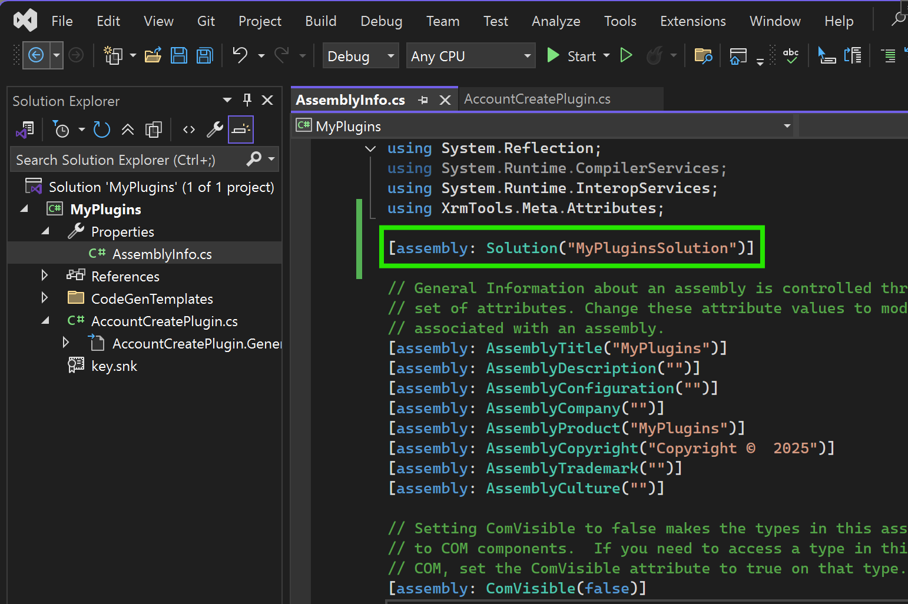

# How to write a plugin template

To make your plugins solution aware, you just need to add a `SolutionAttribute` to your assembly. Since `SolutionAttribute` is an assembly attribute, you can add it anywhere in your code, but assembly attributes are usually added to AssemblyInfo.cs file under Properties in your project.

> [!NOTE]
>
> Make sure that there is a solution with the UniqueName you set for `SolutionAttribute` in your current Dataverse Environment.

